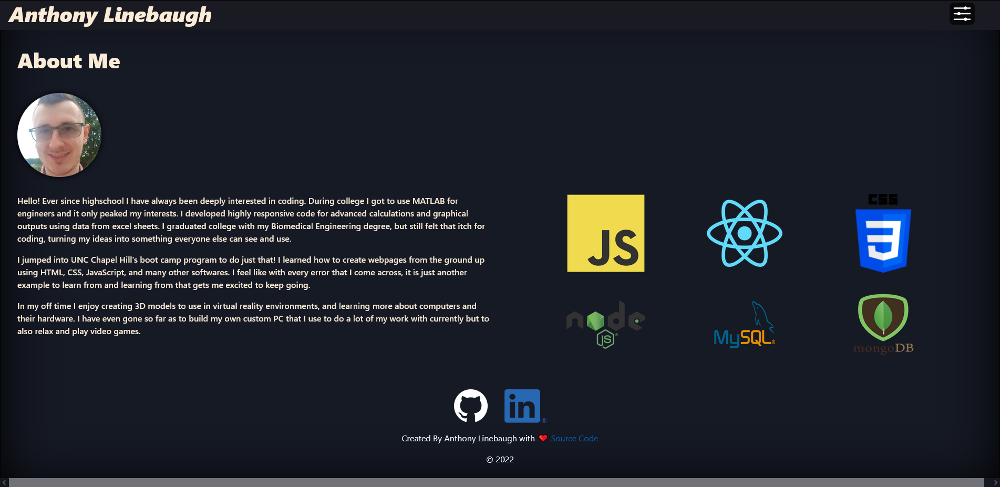

# React Portfolio 

## Table of Contents

- [Description](#description)
- [URLs](#urls)
- [Images](#images)
- [Credits](#credits)
- [License](#license)
- [Questions](#questions)

## Description

An application to showcase not only my previous works but to show them using a React application!

## URLs

GitHub repository: https://github.com/ajlineb/React-Portfolio

Webpage: https://ajlineb.github.io/React-Portfolio/

## Images

## Credits

[gitname](https://github.com/gitname) on github for their help with deploying a react app to github  
You can find this helpful link here to their repository: https://github.com/gitname/react-gh-pages/tree/master

bootstrap for their useful code in laying out information and form code

Github for their image

Linkedin for their image

## License

MIT License

## Questions

Contact by:  
GitHub Username: [ajlineb](https://github.com/ajlineb)  
Email: anthonylinebaugh95@gmail.com
